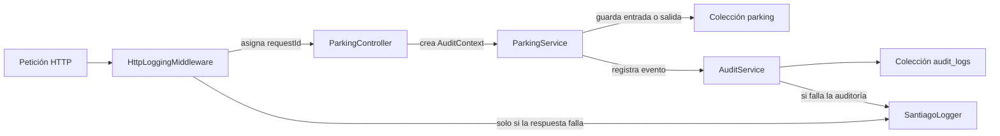

# Logging y auditoría mejorados

Esta guía documenta cómo se diseñó el sistema de logs y auditoría del backend de
Minuto a partir de la experiencia observada en `app-solnatura`.

## Objetivo

Separar dos necesidades que parecen similares, pero cumplen funciones
diferentes:

1. **Logging técnico:** permite diagnosticar peticiones, errores, rendimiento y
   comportamiento del servidor.
2. **Auditoría de negocio:** permite responder quién realizó una acción, sobre
   qué registro, cuándo ocurrió y cuál fue el resultado funcional.

Los logs técnicos se escriben en la salida del proceso. La auditoría de negocio
se conserva en MongoDB.

## Patrón observado en app-solnatura

`app-solnatura` implementa una colección `AuditLog` con Mongoose y un servicio
`recordAudit` que registra acciones administrativas como:

- Inicio y cierre de sesión.
- Creación, edición y eliminación de categorías.
- Creación, edición y eliminación de productos.
- Ajustes de stock.
- Cambios en pedidos.

Cada documento guarda administrador, acción, entidad, resumen, IP, metadata y
los timestamps automáticos de Mongoose.

El patrón tiene dos decisiones positivas que conservamos:

- La auditoría se guarda como información estructurada en MongoDB.
- Si falla la escritura de auditoría, se informa el problema técnico sin
  revertir una operación de negocio que ya terminó correctamente.

## Problemas corregidos

La implementación original dependía de `console.log`, `console.error` y
`morgan("dev")`, sin un formato común ni una zona horaria controlada. Además, la
vista administrativa usaba `toLocaleString("es-CL")` sin declarar
`America/Santiago`, por lo que el resultado dependía de la zona horaria del
servidor.

En Minuto se agregaron las siguientes mejoras:

- Logger centralizado de NestJS.
- Horario de consola forzado a `America/Santiago`.
- Identificador `requestId` para relacionar logs técnicos y auditorías.
- Errores HTTP estructurados en una sola línea; las respuestas exitosas se
  omiten para no repetir las lecturas periódicas del frontend.
- Separación entre logs técnicos y eventos de negocio.
- Rutas registradas sin query strings para reducir filtraciones accidentales.
- Índices MongoDB para las consultas de auditoría.
- Campo `success` usado para distinguir operaciones completadas y rechazadas.
- Sin endpoint público de auditoría mientras no exista autorización
  administrativa.
- Pruebas automatizadas del horario y del comportamiento tolerante a fallos.

## Arquitectura



## Archivos principales

```text
src/
├── audit/
│   ├── audit-context.ts
│   ├── audit.module.ts
│   ├── audit.service.ts
│   ├── audit.service.spec.ts
│   └── entities/
│       └── audit-log.entity.ts
└── common/logging/
    ├── http-logging.middleware.ts
    ├── santiago-time.ts
    ├── santiago-time.spec.ts
    └── santiago.logger.ts
```

## 1. Horario de Chile

MongoDB guarda fechas BSON en UTC. Esto no se cambia, porque UTC permite
ordenar, filtrar y calcular correctamente sin depender del servidor.

Para los logs de consola, `SantiagoLogger` sobrescribe el timestamp de NestJS:

```ts
export class SantiagoLogger extends ConsoleLogger {
  protected getTimestamp(): string {
    return `[${formatSantiagoTime()} America/Santiago]`;
  }
}
```

`Intl.DateTimeFormat` usa la zona IANA `America/Santiago`, que incorpora los
cambios de horario de verano de Chile automáticamente.

Ejemplo de una misma fecha:

```text
MongoDB UTC: 2026-07-21T12:30:00.000Z
Log Chile:   [21-07-2026 08:30:00 America/Santiago]
```

## 2. Logs técnicos HTTP

`HttpLoggingMiddleware` se ejecuta para todas las rutas. Al comenzar una
petición:

1. Reutiliza `x-request-id` únicamente si contiene caracteres seguros y tiene
   como máximo 64 caracteres.
2. En caso contrario genera un UUID.
3. Asigna el identificador a la petición.
4. Devuelve el mismo identificador en la cabecera de respuesta `x-request-id`.
5. Mide la duración con `process.hrtime.bigint()`.

Al finalizar la respuesta solo escribe en consola cuando el estado es `400` o
superior. Las respuestas exitosas, incluidos los `GET` periódicos del frontend,
se omiten. El error se serializa en una sola línea JSON:

```json
{
  "event": "http.request",
  "requestId": "c83e6c13-03f8-40e5-b84f-3fc1d436421c",
  "method": "POST",
  "path": "/parking/entry",
  "statusCode": 409,
  "durationMs": 18.42
}
```

El nivel depende del resultado:

| Estado HTTP | Nivel   |
| ----------- | ------- |
| `200–399`   | `log`   |
| `400–499`   | `warn`  |
| `500–599`   | `error` |

La query string no se incluye. Por ejemplo,
`/parking?status=active&token=...` se registra solamente como `/parking`.

## 3. Contexto de auditoría

El controlador transforma la petición HTTP en un contexto mínimo:

```ts
type AuditContext = {
  actor: string;
  ip?: string;
  userAgent?: string;
  requestId?: string;
};
```

Cuando exista autenticación, se utiliza `request.user.username` o
`request.user.id`. Mientras no haya una identidad autenticada, el actor se
registra como `anonymous`. No se confía en una cabecera arbitraria para definir
el operador.

El `requestId` conecta el evento de MongoDB con el log técnico de la misma
petición.

## 4. Esquema de MongoDB

La colección se llama `audit_logs` y usa timestamps de Mongoose:

```ts
{
  actor: string,
  action: string,
  entityType: string,
  entityId?: string,
  summary?: string,
  metadata?: Record<string, unknown>,
  ip?: string,
  userAgent?: string,
  requestId?: string,
  success: boolean,
  createdAt: Date,
  updatedAt: Date
}
```

Los timestamps permanecen en UTC.

### Índices

Se agregaron índices para los patrones de consulta esperados:

```ts
AuditLogSchema.index({ createdAt: -1 });
AuditLogSchema.index({ entityType: 1, entityId: 1, createdAt: -1 });
```

Los campos `action`, `entityType` y `requestId` también están indexados desde el
esquema.

No se configuró un índice TTL porque una política de eliminación automática de
auditorías debe definirse como decisión legal y operativa, no como un valor
arbitrario del código.

## 5. Eventos de estacionamiento

Se registran estas acciones importantes:

| Acción            | Momento                               | Metadata principal                                               |
| ----------------- | ------------------------------------- | ---------------------------------------------------------------- |
| `parking.entry`   | Después de guardar la entrada         | patente, hora y tarifa                                           |
| `parking.exit`    | Después de guardar el cobro           | patente, entrada, salida, minutos, tarifa, total y medio de pago |
| `parking.evasion` | Después de cerrar una salida sin pago | patente, deuda, motivo y observación                             |

Las mismas acciones se guardan con `success: false` cuando se rechazan por una
regla de negocio. Los códigos controlados actuales son:

- `active-parking-exists`
- `invalid-payment-method`
- `invalid-reason-code`
- `observation-too-long`
- `no-active-parking`

Ejemplo de salida:

```json
{
  "actor": "anonymous",
  "action": "parking.exit",
  "entityType": "Parking",
  "entityId": "669f...",
  "summary": "Salida cobrada: ABCD12",
  "metadata": {
    "vehicleNumber": "ABCD12",
    "entryTime": "2026-07-21T12:00:00.000Z",
    "exitTime": "2026-07-21T13:05:01.000Z",
    "totalMinutes": 66,
    "ratePerMinute": 30,
    "totalCost": 1980,
    "paymentMethod": "debit"
  },
  "ip": "127.0.0.1",
  "userAgent": "Mozilla/5.0 ...",
  "requestId": "c83e6c13-03f8-40e5-b84f-3fc1d436421c",
  "success": true,
  "createdAt": "2026-07-21T13:05:01.000Z"
}
```

## 6. Auditoría tolerante a fallos

La estadía se guarda antes de registrar la auditoría. `AuditService.record()`
captura cualquier error de MongoDB y lo envía al logger técnico:

```ts
try {
  await this.auditLogModel.create(entry);
} catch (error) {
  this.logger.error(
    JSON.stringify({
      event: 'audit.write-failed',
      action: entry.action,
      requestId: entry.requestId,
      error: error.message,
    }),
  );
}
```

Esta estrategia evita que un fallo secundario haga que el operador repita un
cobro ya realizado. El costo es que podría faltar un evento de auditoría. Por
eso `audit.write-failed` debe ser monitoreado y alertado en producción.

Si el negocio exige auditoría transaccional estricta, la siguiente evolución
debería usar una transacción MongoDB o un patrón outbox.

## 7. Seguridad y privacidad

- No se registran cuerpos completos de peticiones.
- No se registran query strings.
- No se guardan contraseñas, tokens ni datos de tarjetas.
- `paymentMethod` representa solamente el tipo de pago, no información
  financiera.
- Los identificadores de petición externos se validan antes de reutilizarlos.
- La consulta de auditorías no se expone públicamente.
- `metadata` debe mantenerse limitada a datos necesarios para explicar la
  acción.

Antes de crear una pantalla o endpoint de auditoría se debe implementar:

1. Autenticación del operador.
2. Rol administrativo.
3. Autorización en servidor.
4. Paginación y filtros limitados.
5. Política de retención y acceso a IP/user-agent.

## 8. Pruebas

Las pruebas actuales verifican:

- Conversión de invierno chileno a UTC-4.
- Conversión de verano chileno a UTC-3.
- Uso fijo de `America/Santiago`.
- Escritura correcta de un evento de auditoría.
- `success: true` como valor predeterminado.
- Que una falla de auditoría no interrumpa la operación principal.
- Que las respuestas exitosas no generen ruido en consola.
- Que los errores HTTP se escriban como JSON en una sola línea.

Para ejecutarlas:

```bash
npm test -- --runInBand
npm run build
```

## Próximos eventos recomendados

Cuando existan autenticación y administración se pueden agregar:

```text
admin.login
admin.logout
parking.rate-update
audit.read
```

Los intentos rechazados ya usan `success: false` y metadata con un código de
motivo controlado, evitando guardar cuerpos completos o información sensible.

## Sugerencia: login de usuarios y operadores

Cuando se implemente el módulo de usuarios, cada operador debe iniciar sesión
antes de registrar entradas, cobros, anulaciones o evasiones. El backend debe
obtener la identidad desde la sesión o token validado y nunca desde una cabecera
libre enviada por el cliente.

La autenticación permitirá reemplazar el actor temporal `anonymous` por datos
confiables:

```ts
{
  actorId: "user-id",
  actor: "operador.caja1",
  actorRole: "operator"
}
```

Acciones recomendadas para la auditoría de usuarios:

```text
user.login
user.login-failed
user.logout
user.create
user.update
user.disable
user.password-reset
```

Reglas de seguridad recomendadas:

- No registrar contraseñas, hashes, tokens, cookies ni códigos de recuperación.
- Auditar los intentos fallidos con un motivo controlado, sin guardar la
  contraseña recibida.
- Permitir que solamente un administrador consulte la auditoría completa.
- Usar roles como `operator`, `supervisor` y `admin`.
- Exigir rol `supervisor` o `admin` para anulaciones, ajustes manuales y
  regularización de evasiones.
- Registrar `actorId` además del nombre visible, porque el nombre puede cambiar.

## Implementación: manejo manual de evasión o salida sin pago

Una evasión no debe registrarse como pago ni eliminar la estadía. Debe cerrar la
permanencia con un estado especial y conservar el monto adeudado.

El alcance actual es completamente manual. No se contemplan barreras, cámaras,
lectores de patentes, sensores ni detección automática. Toda salida, pago o
evasión debe ser registrada por un operador desde el sistema.

### Estados recomendados

El modelo separa el estado de la estadía del estado del pago:

```ts
{
  status: "active" | "completed" | "evaded",
  paymentStatus: "pending" | "paid" | "evaded",
  exitType: "paid" | "evasion",
  totalCost: number,
  amountPaid: number,
  outstandingAmount: number
}
```

Para una evasión:

```text
status = closed
paymentStatus = evaded
exitType = evasion
amountPaid = 0
outstandingAmount = totalCost
```

El monto de la evasión no se suma a la recaudación. Debe aparecer por separado
en el cierre diario como pérdida o deuda pendiente.

### Flujo operativo

1. El operador observa o recibe aviso de que un vehículo abandonó el recinto
   sin completar el pago.
2. Busca manualmente la estadía activa por patente.
3. Selecciona `Registrar salida sin pago`.
4. El sistema muestra patente, hora de entrada, minutos y monto adeudado para
   evitar registrar la estadía equivocada.
5. El operador selecciona un motivo controlado y agrega una observación cuando
   corresponda.
6. Después de una confirmación explícita, el backend calcula la hora de salida,
   cierra la estadía como `evaded` y no crea un pago.
7. Se registra un evento inmutable `parking.evasion` en `audit_logs`.
8. La patente queda asociada a una deuda pendiente para advertirlo en una
   entrada futura.

La operación está disponible actualmente en `POST /parking/evasion`. Cuando
existan usuarios y roles, debería requerir un operador
autenticado. Opcionalmente, el negocio puede exigir confirmación de un
`supervisor` para disminuir errores manuales.

El evento de auditoría recomendado es:

```json
{
  "action": "parking.evasion",
  "entityType": "Parking",
  "entityId": "parking-id",
  "success": true,
  "summary": "Salida sin pago registrada: ABCD12",
  "metadata": {
    "vehicleNumber": "ABCD12",
    "entryTime": "2026-07-21T12:00:00.000Z",
    "exitTime": "2026-07-21T13:05:01.000Z",
    "totalMinutes": 66,
    "totalCost": 1980,
    "amountPaid": 0,
    "outstandingAmount": 1980,
    "reasonCode": "left-without-payment",
    "observation": "Salida sin pago observada por el operador"
  }
}
```

`reasonCode` debe provenir de una lista controlada, por ejemplo:

```text
left-without-payment
payment-refused
operator-record-correction
unknown
other
```

### Regularización posterior pendiente

Si la persona paga después, la evasión original no se modifica ni elimina. Se
crea un pago relacionado, se actualiza la deuda y se registra otro evento:

```text
parking.evasion-settled
```

El evento debe guardar el monto recuperado, medio de pago, operador y referencia
a la evasión original. De esta manera se conserva toda la historia.

### Control manual

Como no existe detección automática, el sistema no puede saber por sí solo que
un vehículo ya no está. El control operativo recomendado es revisar la lista de
estadías activas durante el turno y al cierre de caja.

Si aparece una estadía activa cuyo vehículo ya no se encuentra, el operador
debe revisar la patente y registrar manualmente la salida sin pago. La interfaz
debe exigir una confirmación adicional porque una evasión incorrecta genera una
deuda sobre la patente.

Las integraciones con hardware quedan fuera del alcance funcional actual y no
forman parte del diseño de esta versión.

### Indicadores

El resumen diario ya separa:

- Recaudación efectivamente pagada.
- Cantidad y monto de evasiones.

Para una siguiente versión quedan pendientes:

- Deuda recuperada de evasiones anteriores.
- Evasiones pendientes de revisión por supervisor.
- Tasa de evasión respecto del total de salidas.

## Prompts utilizados

Esta sección conserva las instrucciones que originaron el trabajo y versiones
técnicas normalizadas que permiten repetirlo en otro proyecto.

### Instrucciones originales

```text
Para efectos de logs, usar horario de Chile siempre.
```

```text
Revisa los logs que usaste en app-solnatura.
```

```text
Implementa tu versión mejorada.
```

```text
Crea un documento Markdown que explique cómo hiciste el log mejorado que
tomaste de app-solnatura.
```

```text
Deja como sugerencia que se deben agregar logins de usuarios cuando estén
implementados y explica cómo manejar la evasión o salida sin pagar.
```

```text
El sistema de cobro todavía es manual y no contempla barreras.
```

### Prompt de análisis de la aplicación de referencia

```text
Revisa la implementación de logging y auditoría de app-solnatura sin modificar
archivos. Identifica:

- librerías y mecanismos usados para logs técnicos;
- esquema Mongoose de auditoría;
- servicio que registra eventos;
- acciones de negocio auditadas;
- campos guardados en MongoDB;
- tratamiento de errores;
- formato y zona horaria de las fechas;
- índices y consultas de auditoría;
- riesgos de seguridad, privacidad y rendimiento.

Entrega una comparación entre las decisiones acertadas, las debilidades y las
mejoras recomendadas para un backend NestJS con Mongoose.
```

### Prompt de implementación

```text
Implementa en un backend NestJS con Mongoose un sistema mejorado de logging y
auditoría inspirado en app-solnatura.

Requisitos:

1. Separar logs técnicos de auditoría de negocio.
2. Usar America/Santiago para todos los timestamps de consola y respetar
   automáticamente el horario de verano de Chile.
3. Mantener las fechas BSON de MongoDB en UTC.
4. Crear middleware HTTP estructurado con requestId, método, ruta sin query
   string, estado y duración.
5. Validar x-request-id y generar un UUID cuando no sea seguro.
6. Devolver x-request-id en la respuesta.
7. Crear una colección audit_logs con actor, action, entityType, entityId,
   summary, metadata, ip, userAgent, requestId, success y timestamps.
8. Agregar índices por createdAt, action, entityType, entityId y requestId.
9. Registrar parking.entry después de guardar una entrada.
10. Registrar parking.exit después de guardar el cobro.
11. Relacionar la auditoría con el log HTTP mediante requestId.
12. No registrar contraseñas, tokens, datos de tarjetas, cuerpos completos ni
    query strings.
13. Hacer la escritura de auditoría tolerante a fallos: informar
    audit.write-failed sin revertir una operación ya completada.
14. No crear un endpoint público de auditoría hasta contar con autenticación y
    autorización administrativa.
15. Agregar pruebas para zona horaria, escritura exitosa y fallo tolerado de la
    auditoría.
16. Compilar y ejecutar las pruebas al terminar.
```

### Prompt de revisión de seguridad

```text
Revisa el sistema de logging y auditoría implementado en NestJS/Mongoose.
Comprueba que no se registren secretos ni información financiera, que las query
strings no aparezcan en logs, que requestId esté validado, que las fechas de
MongoDB sigan en UTC, que los logs usen America/Santiago y que la auditoría no
esté expuesta sin autorización. Reporta problemas por prioridad y propone
correcciones concretas.
```

### Prompt de documentación

```text
Documenta en Markdown la solución de logging y auditoría. Explica el patrón
tomado de app-solnatura, las mejoras aplicadas, la arquitectura, el flujo de una
petición, el esquema MongoDB, los índices, la zona horaria, requestId, eventos
de negocio, tolerancia a fallos, seguridad, pruebas y próximos pasos. Incluye un
diagrama Mermaid y ejemplos que no contengan secretos ni datos reales.
```

### Prompt de diseño para evasiones

```text
Diseña el manejo de vehículos que salen de un estacionamiento sin pagar.
Incluye estados separados para estadía y pago, cálculo de deuda, cierre diario,
auditoría inmutable, permisos de operador y supervisor, regularización posterior,
alertas en entradas futuras y confirmación manual. El sistema no tiene barreras,
cámaras, sensores ni lectores de patentes. No contabilices una evasión como
recaudación y evita errores mediante una confirmación explícita del operador.
Documenta qué partes son diseño futuro y no las implementes sin definir primero
las reglas operativas.
```
